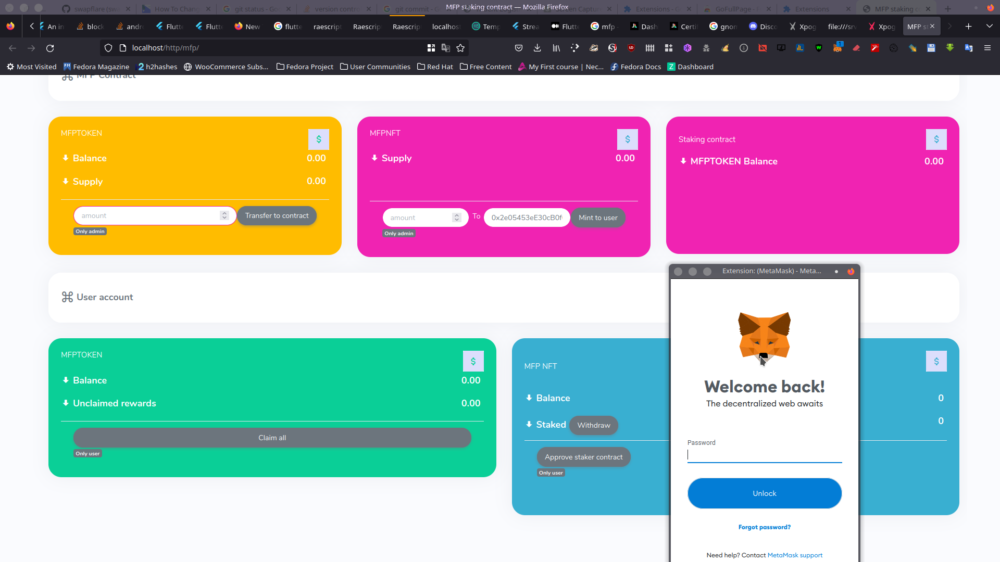

## A highly secure staking contract for nfts. its able to stake nfts for token rewards and allows user to redeem rewards as well as unstake a token at any time
this is the user intyerface for mfp_contract solidity code
## illustration

  

